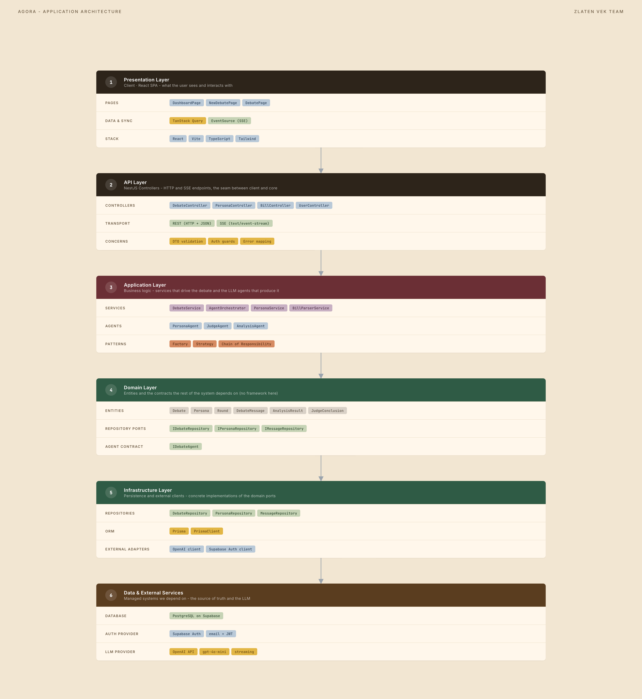

# Zlaten Vek - Agora

> Structured multi-agent AI debates over bills and policies.

Agora turns a piece of legislation into a debate. You upload a PDF or paste text; an analysis agent extracts the groups the bill affects; one persona agent per group argues its corner across structured rounds; a judge agent reads the whole transcript and synthesizes the contradictions, the common ground, and the workable compromises. Replies stream token-by-token in real time.

It is a pnpm + Turborepo monorepo: a NestJS API, a Vite + React web app, and a shared types package, all layered.

## Table of contents

- [How it works](#how-it-works)
- [Features](#features)
- [Architecture](#architecture)
- [Tech stack](#tech-stack)
- [Project layout](#project-layout)
- [Quick start (Docker)](#quick-start-docker)
- [Develop on the host](#develop-on-the-host)
- [Environment variables](#environment-variables)
- [Commands](#commands)
- [API reference](#api-reference)
- [Database](#database)
- [Quality gates](#quality-gates)
- [Deploying to k3s](#deploying-to-k3s)
- [Diagrams](#diagrams)

## How it works

```
PDF / text  ─►  AnalysisAgent  ─►  PersonaAgent × N  ─►  JudgeAgent  ─►  Synthesis
   upload        affected            rounds of           reads the        verdict +
                 groups              debate              transcript       common ground
```

1. **Upload.** `POST /api/debates` with a PDF or raw text creates a debate in `Draft` and kicks off analysis asynchronously.
2. **Analyze.** `AnalysisAgent` calls the LLM, parses the bill into affected groups (name, stance, fears, interests), and persists one `persona` per group. Status moves to `PersonasPending`.
3. **Review.** The user can edit personas (`GET` / `PATCH /api/debates/:id/personas`) before the debate runs.
4. **Debate.** `POST /api/debates/:id/start` hands off to `AgentOrchestrator`, which walks the personas through structured rounds (position, counter, common ground). Each agent's reply streams token-by-token over SSE; every message is emotion-classified and stored.
5. **Judge.** After the final round `JudgeAgent` reads the full history and emits contradictions, common ground, compromises, participant shifts, and a closing statement.
6. **Synthesize.** `GET /api/debates/:id/synthesis` returns the verdict for the synthesis screen; it can be re-run with `POST /api/debates/:id/synthesis/regenerate`.

Two playback modes: **auto-play** runs the whole debate to completion; **step-by-step** pauses at each round gate so the user advances manually (`POST /api/debates/:id/advance`).

## Features

- PDF and plain-text bill ingestion (`pdf-parse`), with guards for scanned/oversized documents.
- Automatic extraction of stakeholder groups into editable personas.
- Multi-round debate with one AI agent per stakeholder, each holding a distinct stance.
- Token-by-token streaming to the browser over Server-Sent Events.
- Per-message emotion classification (calm, confident, pensive, anxious, tense).
- Judge synthesis: contradictions, common ground, compromises, and how each participant shifted.
- Auth via Supabase (email + JWT), per-user debate history.
- Synthesis export to PDF (`@react-pdf/renderer`).

## Architecture

The codebase deliberately keeps the OOP design patterns required by the assignment rubric visible in code:

| Pattern                     | Where                                                                                  |
| --------------------------- | -------------------------------------------------------------------------------------- |
| **Strategy**                | every agent implements `IDebateAgent.generateResponse(context): AsyncIterable<string>` |
| **Chain of Responsibility** | `AgentOrchestrator` walks the agents in round order                                    |
| **Factory**                 | `PersonaAgentFactory` builds agents from the analysis result                           |
| **Repository**              | all DB access goes through `I*Repository` ports                                        |

**Inheritance:** `BaseAgent` → `PersonaAgent | JudgeAgent | AnalysisAgent`.

**Custom exceptions** all extend a shared `AppException` (`DebateNotFoundException`, `PersonaGenerationException`, `BillParsingException`, `ScannedPdfException`, ...).

**Concurrency:** active debate sessions live in a map keyed by debate id; agent generation is async and streamed per-connection (no single stream broadcast to multiple clients).

### Layer rules

**API (inward only):** `presentation` → `application` → `domain`. `infrastructure` implements the `domain` ports and is wired in the module file. `domain` imports nothing - no NestJS, no Prisma, no HTTP types.

**Web (downward only):** `app` → `pages` → `features` → `entities` → `shared`. A lower layer never imports from a higher one.

Any new external dependency (Prisma, OpenAI, Supabase clients) lives in `infrastructure` behind a domain port, never called from a service directly.

## Tech stack

| Area     | Choice                                                                                       |
| -------- | -------------------------------------------------------------------------------------------- |
| Monorepo | pnpm workspaces + Turborepo (Node ≥ 20, pnpm ≥ 10)                                           |
| Web      | Vite 6, React 18, TypeScript, Tailwind v4, TanStack Query, React Router, `EventSource` (SSE) |
| API      | NestJS 10, TypeScript, REST (JSON) + SSE (`text/event-stream`)                               |
| Database | PostgreSQL (Supabase) via Prisma 5                                                           |
| Auth     | Supabase Auth (email + JWT), `passport-jwt`                                                  |
| LLM      | OpenAI API, streaming (model set via `OPENAI_DEFAULT_MODEL`)                                 |
| Shared   | `@agora/shared` - DTOs and HTTP contracts imported by both apps                              |

## Project layout

```
.
├── apps/
│   ├── api/                              # NestJS
│   │   ├── prisma/                       # schema.prisma + migrations
│   │   └── src/
│   │       ├── common/exceptions/        # AppException + subclasses
│   │       └── modules/<feature>/
│   │           ├── domain/               # entities, repository ports, agents (pure)
│   │           ├── application/          # services, orchestrator, use-cases
│   │           ├── infrastructure/       # repository impls, persistence
│   │           └── presentation/         # HTTP controllers, SSE
│   └── web/                              # Vite + React
│       └── src/
│           ├── app/                      # providers, router, global styles
│           ├── pages/                    # route-level pages
│           ├── features/                 # debates, synthesis, auth, profile
│           ├── entities/                 # domain models + per-entity API
│           └── shared/                   # http client, ui, lib
├── packages/
│   └── shared/                           # @agora/shared - enums + HTTP contracts
├── docs/diagrams/                        # architecture, db, infra, uml (source of truth)
├── k8s/                                  # k3s manifests
├── docker-compose.yml
├── turbo.json
└── pnpm-workspace.yaml
```

API modules: `agent`, `analysis`, `auth`, `debate`, `health`, `judge`, `metrics`, `persona`, `prisma`, `round`, `user`.

## Quick start (Docker)

Fastest way to a running stack. Needs Docker + Docker Compose.

```bash
cp .env.example .env          # fill in DATABASE_URL + SUPABASE_* + OPENAI_API_KEY
docker compose up --build     # first run builds the images
```

- Web: http://localhost:5173
- API: http://localhost:3000/health (other routes under `/api`)

The web container serves the Vite production build as static files; `VITE_API_URL` is baked into the bundle at build time. Change a frontend file and you need `docker compose up --build web` to see it. For hot reload, use the host setup below.

The database is Supabase (Postgres) - there is no Postgres container. Local dev points at the `DATABASE_URL` in `.env`.

## Develop on the host

For day-to-day work with hot reload:

```bash
pnpm install
pnpm dev                       # api on :3001, web on :5173
```

- Web: http://localhost:5173
- API: http://localhost:3001/api (proxied from web as `/api/*`)

Copy [apps/api/.env.example](apps/api/.env.example) to `apps/api/.env` and set the Supabase + OpenAI values. Apply the schema:

```bash
pnpm --filter @agora/api db:migrate     # apply migrations
pnpm --filter @agora/api db:generate    # regenerate Prisma client
pnpm --filter @agora/api db:studio      # open Prisma Studio
```

Run one app only:

```bash
pnpm --filter @agora/web dev
pnpm --filter @agora/api dev
```

## Environment variables

`.env` is gitignored; real keys live in GitHub Secrets and k3s Secrets. Full documentation in the `.env.example` files.

**Root [.env.example](.env.example)** (Docker Compose):

| Var                                                           | Purpose                               |
| ------------------------------------------------------------- | ------------------------------------- |
| `API_PORT`                                                    | host port for the api container       |
| `WEB_PORT`                                                    | host port for the web container       |
| `DATABASE_URL`                                                | Postgres / Supabase connection string |
| `SUPABASE_URL`, `SUPABASE_JWT_SECRET`                         | API token verification                |
| `VITE_API_URL`, `VITE_SUPABASE_URL`, `VITE_SUPABASE_ANON_KEY` | baked into the web bundle             |

**API [apps/api/.env.example](apps/api/.env.example)** (host dev) adds:

| Var                                              | Purpose                                                |
| ------------------------------------------------ | ------------------------------------------------------ |
| `PORT`                                           | api port (3001 on host)                                |
| `DIRECT_URL`                                     | direct Postgres connection, required by Prisma Migrate |
| `SUPABASE_ANON_KEY`, `SUPABASE_SERVICE_ROLE_KEY` | Supabase keys                                          |
| `OPENAI_API_KEY`                                 | OpenAI auth                                            |
| `OPENAI_DEFAULT_MODEL`                           | model id used by the agents                            |
| `GOOGLE_API_KEY`                                 | only for the `llm-spike` scripts                       |

## Commands

```bash
pnpm dev          # both apps via turbo (web :5173, api :3001)
pnpm build        # build all workspaces
pnpm typecheck    # tsc --noEmit across the monorepo
pnpm test         # unit tests (coverage target ≥ 50%)
pnpm lint         # ESLint
pnpm format       # Prettier write
```

## API reference

All routes are under the `/api` prefix and require a Supabase JWT unless noted.

**Debates**

| Method   | Route                       | Purpose                               |
| -------- | --------------------------- | ------------------------------------- |
| `POST`   | `/api/debates`              | create a debate, kick off analysis    |
| `GET`    | `/api/debates`              | list the current user's debates       |
| `GET`    | `/api/debates/:id`          | debate detail                         |
| `GET`    | `/api/debates/:id/overview` | debate overview                       |
| `DELETE` | `/api/debates/:id`          | delete a debate                       |
| `POST`   | `/api/debates/:id/start`    | start the debate                      |
| `POST`   | `/api/debates/:id/advance`  | advance one round (step mode)         |
| `GET`    | `/api/debates/:id/stream`   | **SSE** - live debate events / tokens |

**Personas / analysis**

| Method  | Route                             | Purpose                    |
| ------- | --------------------------------- | -------------------------- |
| `GET`   | `/api/debates/:id/personas`       | list personas              |
| `PATCH` | `/api/debates/:id/personas`       | edit personas before start |
| `POST`  | `/api/debates/:id/analysis/retry` | re-run analysis            |

**Synthesis**

| Method | Route                                   | Purpose          |
| ------ | --------------------------------------- | ---------------- |
| `GET`  | `/api/debates/:id/synthesis`            | judge verdict    |
| `POST` | `/api/debates/:id/synthesis/regenerate` | re-run the judge |

The `:id/stream` endpoint is a per-connection `text/event-stream`. The web app subscribes with one `EventSource` per debate; backpressure is handled per connection.

## Database

PostgreSQL on Supabase, accessed via Prisma. Schema in [apps/api/prisma/schema.prisma](apps/api/prisma/schema.prisma), 3NF, snake_case tables:

`users`, `debates`, `personas`, `rounds`, `debate_messages`, `analysis_results`, `judge_conclusions`.

`personas` is its own table (never inline demographics into `debate_messages`). When loading `debate_messages`, `persona` is eager-loaded because the chat UI always needs it. Schema changes ship as new Prisma migration files; applied migrations are never edited. See [docs/diagrams/database-diagram.png](docs/diagrams/database-diagram.png).

## Quality gates

**Husky (local)**

- **pre-commit** - `lint-staged` (ESLint `--fix` + Prettier on staged files) then `pnpm typecheck`.
- **pre-push** - `gitleaks` then `pnpm test`. Install gitleaks once: `brew install gitleaks`.

Hooks install via the `prepare` script after `pnpm install`. Don't bypass with `--no-verify`.

**CI** ([.github/workflows/ci.yml](.github/workflows/ci.yml)) - on every PR to `main` and push to non-`main` branches: `lint` → `secret-scan` → `type-check` → `test` → `build`. A `notify` job comments on the PR if a job fails.

**CD** ([.github/workflows/cd.yml](.github/workflows/cd.yml)) - on push to `main` and `v*` tags: builds multi-stage images for both apps and pushes them to GHCR (`ghcr.io/<owner>/agora-api`, `ghcr.io/<owner>/agora-web`). Size budget: api < 300 MB, web < 50 MB.

**Branch protection** on `main`: PR required, ≥ 1 approval, all status checks green, conversation resolution required, no force pushes.

## Deploying to k3s

Manifests in [k8s/](k8s/). Target runtime is k3s (or local k3d) with the bundled Traefik ingress.

- [namespace.yaml](k8s/namespace.yaml) - `agora` namespace.
- [api-deployment.yaml](k8s/api-deployment.yaml) / [api-service.yaml](k8s/api-service.yaml) - NestJS API, 3 replicas.
- [api-hpa.yaml](k8s/api-hpa.yaml) - HPA: min 3, max 6, target 70% CPU.
- [web-deployment.yaml](k8s/web-deployment.yaml) / [web-service.yaml](k8s/web-service.yaml) - Vite web served by `serve`, 2 replicas.
- [ingress.yaml](k8s/ingress.yaml) - Traefik `IngressRoute`: `/api` → api, `/` → web.

Secrets and the GHCR pull secret are created out of band:

```bash
kubectl apply -f k8s/namespace.yaml

kubectl -n agora create secret docker-registry ghcr-secret \
  --docker-server=ghcr.io \
  --docker-username=<gh-user> \
  --docker-password=<gh-token>

kubectl -n agora create secret generic agora-secrets \
  --from-literal=DATABASE_URL=... \
  --from-literal=DIRECT_URL=... \
  --from-literal=SUPABASE_URL=... \
  --from-literal=SUPABASE_JWT_SECRET=... \
  --from-literal=OPENAI_API_KEY=...

kubectl apply -f k8s/
```

CD bumps the image tag in the deployments from the `0000000` placeholder to the commit SHA.

## Diagrams

The diagrams in [docs/diagrams/](docs/diagrams/) are the source of truth and graded artifacts. Keep them in sync with the code in the same PR that changes architecture, DB schema, class hierarchy, or infra.

### System architecture



### Database (ER model)


### Class hierarchy and patterns (UML)


### Infrastructure (k3s + Postgres + OpenAI)


