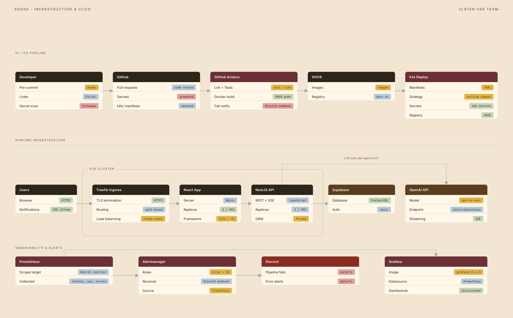
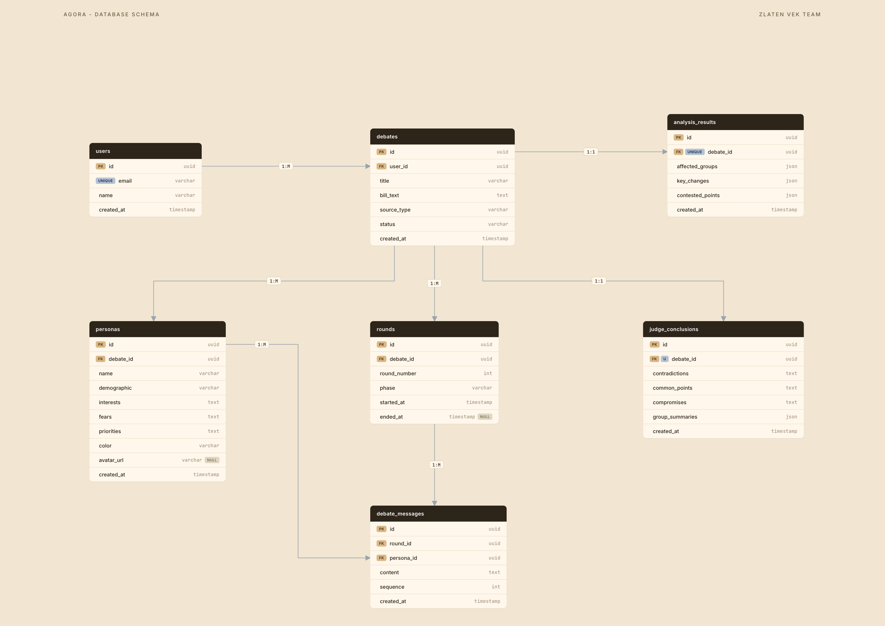
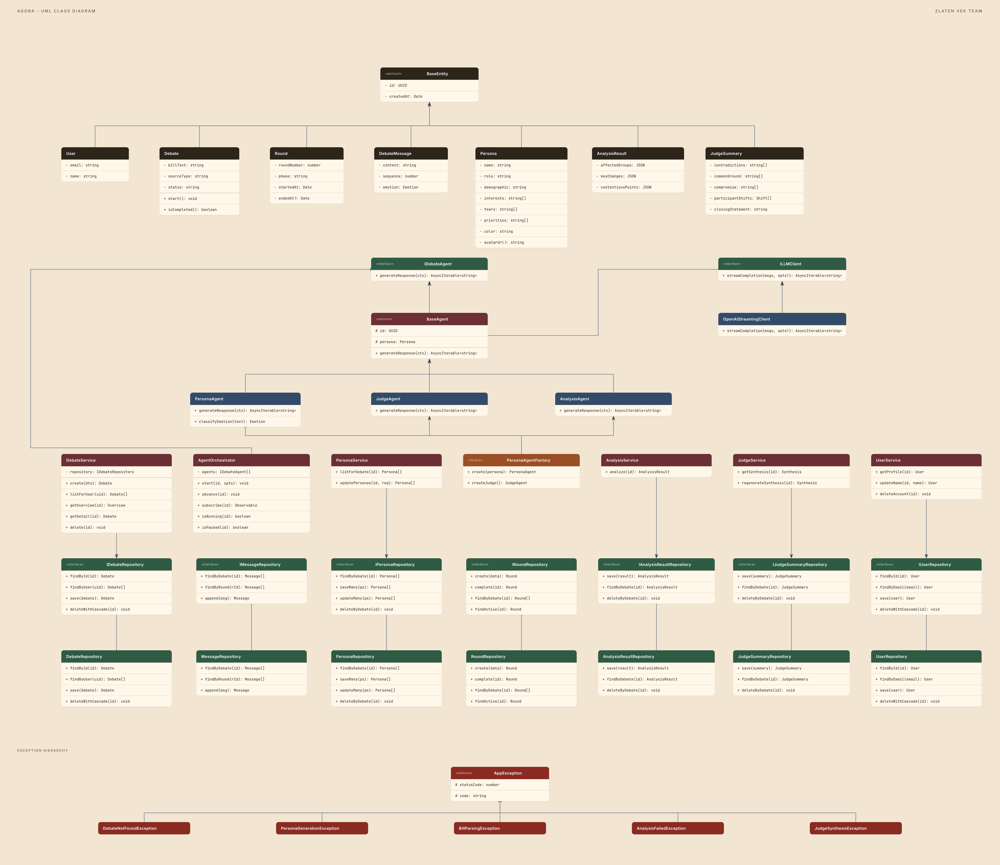
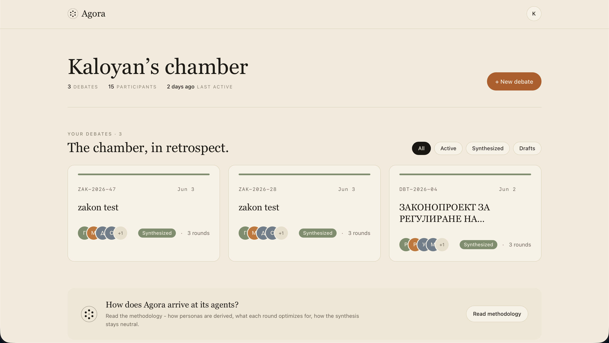
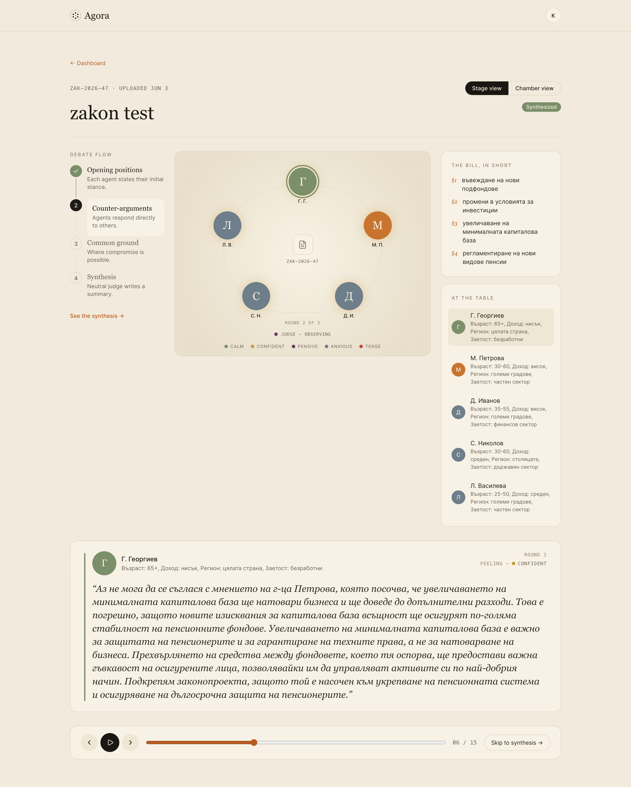
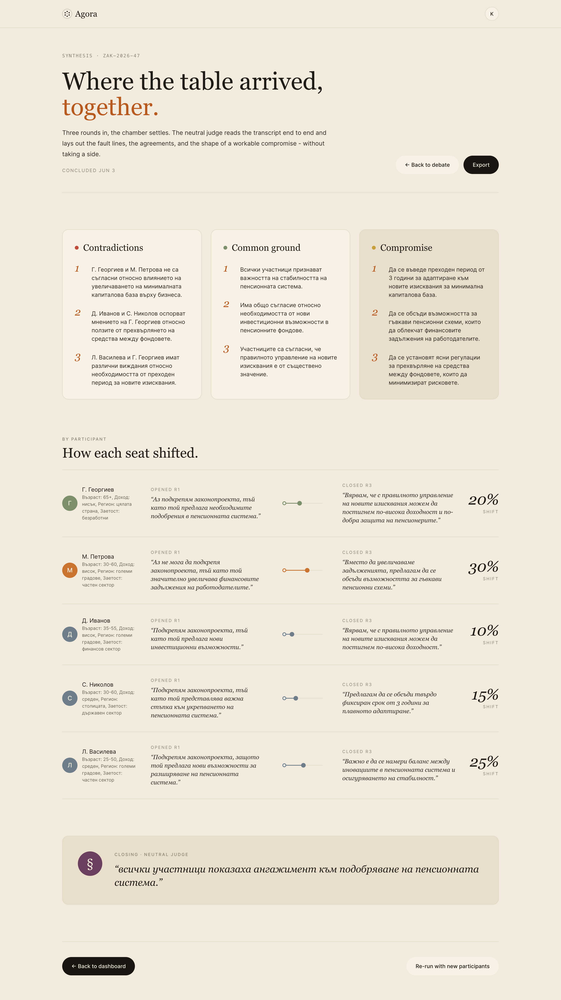
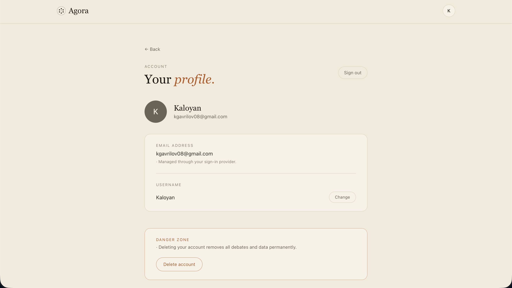

# Agora - Документация

**Екип:** Zlaten Vek (TUES 2026, PBL, 11 клас)
**Технологичен стек:** React + Vite + TypeScript (web), NestJS + TypeScript (api), PostgreSQL (Supabase) + Prisma, OpenAI, Docker, Kubernetes (k3s), Traefik, Prometheus + Grafana + Alertmanager, GitHub Actions.

---

## Съдържание

- [Увод](#увод)
- [1. Анализ и проучване](#1-анализ-и-проучване)
  - [1.1 Предметна област и целева аудитория](#11-предметна-област-и-целева-аудитория)
  - [1.2 Преглед на съществуващи решения](#12-преглед-на-съществуващи-решения)
  - [1.3 Аргументация за избор на технологии](#13-аргументация-за-избор-на-технологии)
- [2. Проектиране](#2-проектиране)
  - [2.1 Функционални изисквания](#21-функционални-изисквания)
  - [2.2 Архитектура на системата](#22-архитектура-на-системата)
  - [2.3 Инфраструктурна диаграма](#23-инфраструктурна-диаграма)
  - [2.4 Схема на базата данни](#24-схема-на-базата-данни)
  - [2.5 UML class диаграма](#25-uml-class-диаграма)
- [3. Реализация](#3-реализация)
  - [3.1 Файлова структура](#31-файлова-структура)
  - [3.2 Сървърна част - API](#32-сървърна-част---api)
  - [3.3 Клиентска част - React](#33-клиентска-част---react)
  - [3.4 База данни - модели и заявки](#34-база-данни---модели-и-заявки)
  - [3.5 Тестване](#35-тестване)
- [4. Инфраструктура](#4-инфраструктура)
  - [4.1 Docker конфигурация](#41-docker-конфигурация)
  - [4.2 CI/CD Pipeline](#42-cicd-pipeline)
  - [4.3 Kubernetes и наблюдаемост](#43-kubernetes-и-наблюдаемост)
  - [4.4 Инструкции за стартиране](#44-инструкции-за-стартиране)
- [5. Екранни снимки](#5-екранни-снимки)
- [6. AI инструменти](#6-ai-инструменти)
- [Заключение](#заключение)
- [Източници](#източници)
- [Приложения](#приложения)

---

## Увод

Гражданите рядко имат реален поглед върху това как един законопроект ще се отрази на различните обществени групи. Официалните обществени консултации са бавни, формални и недостъпни за обикновения човек, а директното задаване на въпрос към AI чатбот дава една единствена, осреднена гледна точка - без сблъсък на интереси, без trade-off-и, без структуриран дебат.

**Agora** е уеб приложение, което симулира структуриран многостранен дебат върху законопроекти и обществени политики. Потребителят качва PDF с текста на законопроект или го въвежда директно. Системата автоматично анализира съдържанието, определя засегнатите обществени групи и генерира по един AI агент за всяка група с конкретна персона - демография, интереси, страхове, приоритети. Агентите дебатират в структурирани рундове, видими като жив чат с аватари и цветове. Финален неутрален агент-съдия синтезира дискусията и извежда основните противоречия, общите точки и възможни компромиси.

Целта не е да се даде "правилният" отговор. Целта е да се покажат реалните притеснения и trade-off-ите от различните гледни точки на обществото - нещо, което нито една от съществуващите алтернативи не прави автоматично.

---

## 1. Анализ и проучване

### 1.1 Предметна област и целева аудитория

Предметната област е **гражданско участие в законодателния процес** - конкретно осмислянето на това как предложена политика засяга различни обществени групи. Един жилищен закон например не засяга "обществото" еднообразно: наемателят, наемодателят, строителната компания, общинският съветник и младият човек, търсещ първи дом, имат коренно различни интереси и страхове. Тези гледни точки рядко са събрани на едно място в разбираем вид.

**Целева аудитория:**

| Група                                         | Нужда                                                   | Болка днес                                               |
| --------------------------------------------- | ------------------------------------------------------- | -------------------------------------------------------- |
| Граждани, засегнати от конкретна политика     | Бързо да разберат как ги засяга даден закон             | Юридическият текст е недостъпен; нямат време да го четат |
| Журналисти и анализатори                      | Бърз преглед на конфликтните точки и засегнатите страни | Ръчният анализ е бавен                                   |
| Студенти и преподаватели (право, политология) | Учебен инструмент за разбиране на trade-off-и           | Липсва интерактивен симулатор                            |
| НПО и граждански организации                  | Изходна точка за становище                              | Започват от нула при всеки нов законопроект              |

_Таблица 1: Целева аудитория_

**Ключови нужди:** разбираемо обобщение на законопроекта; идентификация на засегнатите групи; структуриран сблъсък на позициите; неутрален синтез с конкретни компромисни точки.

### 1.2 Преглед на съществуващи решения

#### 1.2.1 Официални обществени консултации (strategy.bg)

Официалният канал за подаване на становища по нормативни актове.

| Аспект   | Оценка                                                                                            |
| -------- | ------------------------------------------------------------------------------------------------- |
| Предлага | Формален, легитимен канал за становища                                                            |
| Липсва   | Бавно, сложно, недостъпно за обикновения гражданин; не симулира дебат, само събира писмени мнения |

_Таблица 2: Официални обществени консултации_

#### 1.2.2 ChatGPT / Claude (директно)

Общодостъпни LLM асистенти.

| Аспект   | Оценка                                                                                                                                                           |
| -------- | ---------------------------------------------------------------------------------------------------------------------------------------------------------------- |
| Предлага | Може да анализира текст и да даде обобщение                                                                                                                      |
| Липсва   | Единична, осреднена гледна точка; няма структуриран дебат между множество персони; няма автоматично определяне на засегнатите групи; няма синтез на противоречия |

_Таблица 3: ChatGPT / Claude (директно)_

#### 1.2.3 Академични дебатни инструменти

Структури за формален дебат (Karl Popper, British Parliamentary).

| Аспект   | Оценка                                                                                  |
| -------- | --------------------------------------------------------------------------------------- |
| Предлага | Структурирани аргументи и правила за разисквания                                        |
| Липсва   | Не са автоматизирани; изискват ръчно въвеждане на позиции и хора, които да ги защитават |

_Таблица 4: Академични дебатни инструменти_

#### Обобщение - сравнителна матрица

| Възможност                          | Обществени консултации | ChatGPT/Claude | Академични дебати | **Agora** |
| ----------------------------------- | :--------------------: | :------------: | :---------------: | :-------: |
| Автоматичен анализ на текста        |           ✗            |       ✓        |         ✗         |     ✓     |
| Авто-определяне на засегнати групи  |           ✗            |    частично    |         ✗         |     ✓     |
| Множество гледни точки едновременно |        частично        |       ✗        |         ✓         |     ✓     |
| Структуриран дебат в рундове        |           ✗            |       ✗        |         ✓         |     ✓     |
| Неутрален синтез + компромиси       |           ✗            |    частично    |         ✗         |     ✓     |
| Достъпно за обикновен гражданин     |           ✗            |       ✓        |         ✗         |     ✓     |

_Таблица 5: Сравнителна матрица на решенията_

Agora е новото решение, което покрива всички горни пропуски: автоматичен анализ + динамични агенти + структуриран дебат + синтез.

### 1.3 Аргументация за избор на технологии

| Технология                    | Защо                                                                                                                                                                                                       |
| ----------------------------- | ---------------------------------------------------------------------------------------------------------------------------------------------------------------------------------------------------------- |
| **React + Vite + TypeScript** | Бърз dev сървър (HMR), типова безопасност споделена с бекенда, голяма екосистема. Чатът с реалновремеви стрийминг изисква отзивчив компонентен модел.                                                      |
| **NestJS + TypeScript**       | Модулна архитектура с вграден Dependency Injection - позволява чиста слоеста архитектура. Споделя типове и DTO-та с фронтенда през `@agora/shared`.                                                        |
| **PostgreSQL (Supabase)**     | Данните имат ясни релации (debate → personas → messages), нужни са наредени заявки по `round_number` и транзакционна консистентност при едновременен стрийминг. Supabase добавя готова Auth (email + JWT). |
| **Prisma ORM**                | Типово-безопасен достъп до БД, декларативни миграции с timestamp, eager/lazy loading контрол.                                                                                                              |
| **OpenAI**                    | Стрийминг token-by-token, ниска цена за дълги дебати с много агенти, добро следване на JSON схеми за структурирани изходи (анализ, синтез).                                                                |
| **Server-Sent Events (SSE)**  | Еднопосочен стрийминг сървър → клиент пасва идеално за token-by-token реплики; по-лек от WebSocket за случая.                                                                                              |
| **Docker + k3s + Traefik**    | Лек Kubernetes за самостоятелен хостинг; декларативни манифести (IaC); HPA за автоскалиране на API и web.                                                                                                  |
| **pnpm + Turborepo**          | Монорепо с workspace кеширане - бекенд, фронтенд и споделени типове в едно репо.                                                                                                                           |

_Таблица 6: Избор на технологии_

**Защо релационна, а не NoSQL:** релациите са присъщи на домейна (дебат съдържа персони, персони създават съобщения, рундове групират съобщения). Нужни са наредени заявки по `round_number` и транзакционна консистентност при каскадно изтриване и едновременен стрийминг. MongoDB не би дал предимство тук.

---

## 2. Проектиране

### 2.1 Функционални изисквания

**FR-1: Аутентикация**

| ID     | Изискване                                                                    | Приоритет |
| :----- | :--------------------------------------------------------------------------- | :-------- |
| FR-1.1 | Регистрация с email и парола (Supabase Auth)                                 | Висок     |
| FR-1.2 | Потвърждение на email преди вход                                             | Висок     |
| FR-1.3 | Вход с email и парола; издаване на JWT                                       | Висок     |
| FR-1.4 | Защитени маршрути - неавтентикиран потребител се пренасочва към `/login`     | Висок     |
| FR-1.5 | Преглед и редакция на профил (име); изтриване на акаунт с каскадно изтриване | Среден    |

_Таблица 7: Функционални изисквания - Аутентикация_

**FR-2: Създаване на дебат**

| ID     | Изискване                                                                    | Приоритет |
| :----- | :--------------------------------------------------------------------------- | :-------- |
| FR-2.1 | Качване на PDF (drag-drop или файлов избор) с текста на законопроект         | Висок     |
| FR-2.2 | Алтернативно директно въвеждане на текст (минимум 200 символа)               | Висок     |
| FR-2.3 | Задължително заглавие на законопроекта (макс. 200 символа)                   | Среден    |
| FR-2.4 | Валидация на PDF - magic bytes, отхвърляне на сканирани PDF без текстов слой | Висок     |
| FR-2.5 | Ограничение на дължината (200 - 200 000 символа)                             | Среден    |

_Таблица 8: Функционални изисквания - Създаване на дебат_

**FR-3: Анализ и персони**

| ID     | Изискване                                                                    | Приоритет |
| :----- | :--------------------------------------------------------------------------- | :-------- |
| FR-3.1 | `AnalysisAgent` извежда засегнати групи, ключови промени и спорни точки      | Висок     |
| FR-3.2 | По една `Persona` за всяка засегната група (4-6 групи)                       | Висок     |
| FR-3.3 | Преглед на персоните преди старт - картичка с демография, интереси, страхове | Висок     |
| FR-3.4 | Премахване на персона (но не под 2 персони)                                  | Среден    |
| FR-3.5 | Опресняване на статуса на анализа на всеки 2 секунди до завършване           | Нисък     |

_Таблица 9: Функционални изисквания - Анализ и персони_

**FR-4: Дебат**

| ID     | Изискване                                                                      | Приоритет |
| :----- | :----------------------------------------------------------------------------- | :-------- |
| FR-4.1 | Структурирани рундове: Позиция → Контрааргументи → Общо основание              | Висок     |
| FR-4.2 | Всеки агент получава пълната история на дебата като контекст                   | Висок     |
| FR-4.3 | Token-by-token стрийминг на репликите по SSE                                   | Висок     |
| FR-4.4 | Режим auto-play - дискусията тече до край автоматично                          | Висок     |
| FR-4.5 | Режим стъпка-по-стъпка - потребителят сам преминава към следващия рунд         | Висок     |
| FR-4.6 | Класификация на емоция за всяка реплика (calm/confident/pensive/anxious/tense) | Нисък     |

_Таблица 10: Функционални изисквания - Дебат_

**FR-5: Синтез (заключение)**

| ID     | Изискване                                                                  | Приоритет |
| :----- | :------------------------------------------------------------------------- | :-------- |
| FR-5.1 | `JudgeAgent` извежда противоречия, общи точки и компромисни предложения    | Висок     |
| FR-5.2 | За всяка персона - как се е променила позицията ѝ в хода на дебата (shift) | Висок     |
| FR-5.3 | Заключително изявление на съдията                                          | Среден    |
| FR-5.4 | Регенериране на синтеза                                                    | Среден    |
| FR-5.5 | Експорт на синтеза в PDF                                                   | Нисък     |

_Таблица 11: Функционални изисквания - Синтез_

**FR-6: Табло (dashboard)**

| ID     | Изискване                                                         | Приоритет |
| :----- | :---------------------------------------------------------------- | :-------- |
| FR-6.1 | Картички с всички дебати (заглавие, код, дата, участници, статус) | Висок     |
| FR-6.2 | Филтри: всички / активни / синтезирани / чернови                  | Среден    |
| FR-6.3 | Обобщена статистика (брой дебати, участници, последна активност)  | Среден    |
| FR-6.4 | Панел за активни в момента дебати                                 | Нисък     |

_Таблица 12: Функционални изисквания - Табло_

### 2.2 Архитектура на системата

Системата следва Layered Architecture и от двете страни. Бизнес логиката е изцяло отделена от транспорта (HTTP/SSE) и от данните (SQL).

**API (вътрешна посока): `presentation → application → domain`**, а `infrastructure` имплементира port-овете на `domain` и се закача в module файла. `domain` не зависи от нищо - няма NestJS, няма Prisma, няма HTTP типове.

| Слой           | Отговорност                                | Пример                                                                    |
| -------------- | ------------------------------------------ | ------------------------------------------------------------------------- |
| Presentation   | HTTP контролери, SSE endpoint-и, валидация | `DebateController`, `JudgeController`                                     |
| Application    | Use-case оркестрация, услуги               | `AgentOrchestrator`, `DebateService`, `AnalysisService`                   |
| Domain         | Чисти entity-та, port-ове, бизнес правила  | `BaseAgent`, `IDebateAgent`, `IDebateRepository`                          |
| Infrastructure | Имплементации на port-овете                | `PrismaDebateRepository`, `OpenAIStreamingClient`, `PdfBillTextExtractor` |

_Таблица 13: Слоеве на API архитектурата_

**Web (надолу): `app → pages → features → entities → shared`.** По-нисък слой никога не импортва от по-висок.

**NestJS модули** (`apps/api/src/modules/`): `auth`, `user`, `debate`, `persona`, `agent`, `analysis`, `judge`, `round`, `metrics`, `health`, `prisma`. Всеки feature модул има свои `domain / application / infrastructure / presentation` папки.

**Design patterns (с обосновка):**

| Pattern                     | Къде                                                                                                                       | Защо                                                                             |
| --------------------------- | -------------------------------------------------------------------------------------------------------------------------- | -------------------------------------------------------------------------------- |
| **Strategy**                | `IDebateAgent.generateResponse(context)` - всеки агент (`PersonaAgent`, `JudgeAgent`, `AnalysisAgent`) е отделна стратегия | Различни персони, единна точка на извикване; нов тип агент не променя извикващия |
| **Chain of Responsibility** | `AgentOrchestrator` подава хода последователно на всеки агент в реда на рунда                                              | Подреден обход на агентите без те да знаят един за друг                          |
| **Factory**                 | `PersonaAgentFactory.create(persona)` и `.createJudge()` строят агенти от `AnalysisResult`                                 | Капсулира конструирането и инжектирането на `ILLMClient`                         |
| **Repository**              | Всички `I*Repository` port-ове + `Prisma*Repository` имплементации                                                         | Абстрахира достъпа до БД зад domain интерфейс                                    |
| **Dependency Injection**    | NestJS DI - услугите зависят от symbol-token-и (`LLM_CLIENT`, `DEBATE_REPOSITORY`)                                         | Размяна на имплементация без промяна на потребителя                              |

_Таблица 14: Design patterns_

**SOLID принципи:**

| Принцип | Приложение                                                                                                                                  |
| ------- | ------------------------------------------------------------------------------------------------------------------------------------------- |
| **SRP** | `AgentOrchestrator` само управлява реда на рундовете и агентите; не генерира съдържание и не пише в БД директно (през repository port-ове). |
| **OCP** | Нов тип агент се добавя чрез нов подклас на `BaseAgent`, без промяна на `AgentOrchestrator`.                                                |
| **DIP** | `AgentOrchestrator` зависи от `IDebateAgent`, не от конкретни агенти; услугите зависят от `I*Repository`, не от Prisma.                     |

_Таблица 15: SOLID принципи_

### 2.3 Инфраструктурна диаграма



_Фигура 1: Инфраструктурна диаграма_

| Компонент                           | Роля                                                                                                        |
| ----------------------------------- | ----------------------------------------------------------------------------------------------------------- |
| Traefik IngressRoute                | Маршрутизация: `PathPrefix(/api)` → api service (priority 100), `PathPrefix(/)` → web service (priority 10) |
| Web Deployment                      | 2 реплики, `serve` сервира Vite билда, port 80                                                              |
| API Deployment                      | 3 реплики, NestJS, port 3000, initContainer пуска Prisma миграции, non-root user 1001                       |
| API HPA                             | Min 3 / Max 6 реплики, scale при CPU > 70%                                                                  |
| Web HPA                             | Min 2 / Max 4 реплики, scale при CPU > 70%                                                                  |
| Supabase (PostgreSQL)               | Управлявана база + Auth                                                                                     |
| OpenAI API                          | LLM генерация, стрийминг                                                                                    |
| Prometheus + Grafana + Alertmanager | Метрики, дашборди, алерти → Discord                                                                         |
| GHCR                                | Container registry за image-ите                                                                             |

_Таблица 16: Компоненти на инфраструктурата_

### 2.4 Схема на базата данни



_Фигура 2: ER диаграма на базата данни_

Базата е в **3NF**.

#### Таблици

**`users`** - системни потребители.

| Колона       | Тип       | Бележка       |
| ------------ | --------- | ------------- |
| `id`         | uuid      | PK            |
| `email`      | text      | UNIQUE        |
| `name`       | text      |               |
| `created_at` | timestamp | default now() |

_Таблица 17: Таблица users_

**`debates`** - една дебатна сесия върху законопроект.

| Колона        | Тип       | Бележка                      |
| ------------- | --------- | ---------------------------- |
| `id`          | uuid      | PK                           |
| `user_id`     | uuid      | FK → users.id                |
| `title`       | text      | заглавие                     |
| `bill_text`   | text      | пълен текст на законопроекта |
| `source_type` | text      | "pdf" или "text"             |
| `status`      | text      | default "draft"              |
| `created_at`  | timestamp | default now()                |

_Таблица 18: Таблица debates_

**`personas`** - една засегната група (отделна таблица, не се дублира в съобщенията).

| Колона        | Тип       | Бележка                                   |
| ------------- | --------- | ----------------------------------------- |
| `id`          | uuid      | PK                                        |
| `debate_id`   | uuid      | FK → debates.id                           |
| `name`        | text      | име на персоната                          |
| `role`        | text      | роля/група (напр. "наемател"), default "" |
| `demographic` | text      | демография                                |
| `interests`   | jsonb     | масив от интереси                         |
| `fears`       | jsonb     | масив от страхове                         |
| `priorities`  | jsonb     | масив от приоритети                       |
| `color`       | text      | UI цвят                                   |
| `avatar_url`  | text?     | опционален аватар                         |
| `created_at`  | timestamp | default now()                             |

_Таблица 19: Таблица personas_

**`rounds`** - един рунд от дебата.

| Колона         | Тип        | Бележка                           |
| -------------- | ---------- | --------------------------------- |
| `id`           | uuid       | PK                                |
| `debate_id`    | uuid       | FK → debates.id                   |
| `round_number` | int        | пореден номер (1,2,3)             |
| `phase`        | text       | Position / Counter / CommonGround |
| `started_at`   | timestamp  | default now()                     |
| `ended_at`     | timestamp? | при завършване                    |

_Таблица 20: Таблица rounds_

Индекс: `(debate_id, round_number)`.

**`debate_messages`** - една реплика на една персона в един рунд.

| Колона       | Тип          | Бележка             |
| ------------ | ------------ | ------------------- |
| `id`         | uuid         | PK                  |
| `debate_id`  | uuid         | FK → debates.id     |
| `round_id`   | uuid         | FK → rounds.id      |
| `persona_id` | uuid         | FK → personas.id    |
| `content`    | text         | текст на репликата  |
| `sequence`   | int          | ред на хода в рунда |
| `emotion`    | enum Emotion | default `calm`      |
| `created_at` | timestamp    | default now()       |

_Таблица 21: Таблица debate_messages_

Индекси: `(debate_id, created_at)` за хронология, `(round_id, sequence)` за реда на ходовете.

**`analysis_results`** - резултат от началния анализ (1:1 с debate).

| Колона               | Тип       | Бележка                |
| -------------------- | --------- | ---------------------- |
| `id`                 | uuid      | PK                     |
| `debate_id`          | uuid      | FK UNIQUE → debates.id |
| `affected_groups`    | jsonb     | засегнати групи        |
| `key_changes`        | jsonb     | ключови промени        |
| `contentious_points` | jsonb     | спорни точки           |
| `created_at`         | timestamp | default now()          |

_Таблица 22: Таблица analysis_results_

**`judge_conclusions`** - финален синтез (1:1 с debate).

| Колона               | Тип       | Бележка                |
| -------------------- | --------- | ---------------------- |
| `id`                 | uuid      | PK                     |
| `debate_id`          | uuid      | FK UNIQUE → debates.id |
| `contradictions`     | jsonb     | противоречия           |
| `common_ground`      | jsonb     | общи точки             |
| `compromise`         | jsonb     | компромиси             |
| `participant_shifts` | jsonb     | промени на позициите   |
| `closing_statement`  | text      | заключително изявление |
| `created_at`         | timestamp | default now()          |

_Таблица 23: Таблица judge_conclusions_

**Enum `Emotion`:** `calm`, `confident`, `pensive`, `anxious`, `tense`.

#### Релации

- `users 1:N debates`
- `debates 1:N personas`
- `debates 1:N rounds`
- `debates 1:N debate_messages`
- `personas 1:N debate_messages`
- `rounds 1:N debate_messages`
- `debates 1:1 analysis_results` (опц.)
- `debates 1:1 judge_conclusions` (опц.)

**Нормализация (3NF):** `personas` е отделна таблица - демографските данни не се дублират в `debate_messages`. `round_number` е атрибут на рунда (int), не конкатениран низ. Всички полета са атомарни или FK; няма изводими дублирани полета. Каскадното изтриване се прави с явни `$transaction()` в repository-тата (на ниво схема всички FK са `ON DELETE RESTRICT`).

**ORM (Prisma):** `debate_messages` се **eager-load**-ват заедно с `persona` (`include: { persona: true, round: { select: { roundNumber } } }`) - чат UI винаги има нужда от персоната. Списъкът с персони и пълната история се зареждат **lazy** при нужда.

### 2.5 UML class диаграма



_Фигура 3: UML class диаграма_

**Наследяване:** `BaseAgent` → `PersonaAgent`, `JudgeAgent`, `AnalysisAgent`. `BaseAgent` имплементира абстракцията `IDebateAgent` (id + `generateResponse(context): AsyncIterable<string>`).

**Абстракция:** `IDebateAgent` - единен интерфейс за всички агенти (Strategy).

**Полиморфизъм:** `AgentOrchestrator` вика `generateResponse(context)` върху всеки агент, без да знае конкретния му тип.

**Капсулация:** историята на дебата и състоянието на сесията се управляват вътрешно в `DebateSession` / orchestrator-а; persona полетата (`interests`, `fears`, `priorities`) са капсулирани в `PersonaEntity`.

**Композиция:** `Debate` съдържа `Round`-ове, `Round` съдържа `DebateMessage`-и.

**Generics и Collections:** `Map<string, DebateSession>` за активни сесии, `Promise<DebateEntity | null>` (Optional-еквивалент) при търсене по ID, `List<DebateMessage>` за историята.

---

## 3. Реализация

### 3.1 Файлова структура

```
.
├── apps/
│   ├── api/                                # NestJS - layered
│   │   ├── prisma/
│   │   │   ├── schema.prisma                # модели + enum Emotion
│   │   │   └── migrations/                  # 6 миграции с timestamp
│   │   └── src/
│   │       ├── common/exceptions/          # AppException + подкласове
│   │       ├── common/interceptors/        # http-metrics.interceptor
│   │       └── modules/
│   │           ├── agent/                   # BaseAgent, Persona/Judge agent, Factory, OpenAI client
│   │           ├── analysis/               # AnalysisAgent, AnalysisService
│   │           ├── debate/                 # AgentOrchestrator, DebateService, controllers, repos
│   │           ├── persona/                # PersonaService, repo
│   │           ├── judge/                  # JudgeService, controller
│   │           ├── round/                  # Round repo
│   │           ├── auth/ user/             # Supabase Auth, профил
│   │           ├── metrics/ health/        # Prometheus, health check
│   │           └── prisma/                 # глобален PrismaService
│   └── web/                                # Vite + React + TS - layered
│       └── src/
│           ├── app/                        # providers, router, global styles
│           ├── pages/                      # route-level страници
│           ├── features/                   # auth, debates, synthesis, profile
│           ├── entities/                   # domain модели
│           └── shared/                     # http client, ui, lib
├── packages/shared/                        # @agora/shared - DTO + HTTP контракти
├── k8s/                                    # манифести + observability
├── docs/diagrams/                          # PNG диаграми (source of truth)
└── .github/workflows/                      # ci.yml, cd.yml
```

_Листинг 1: Файлова структура на проекта_

### 3.2 Сървърна част - API

#### Жизнен цикъл на дебата

1. **Създаване** - `DebateService.create()` записва чернова и пуска анализа detached (асинхронно).
2. **Анализ** - `AnalysisService.analyze()` пуска `AnalysisAgent` (с 2 опита retry), парсва JSON изхода и създава персони. Статусът минава през `Analyzing → PersonasPending`.
3. **Старт** - `AgentOrchestrator.start()` създава `DebateSession`, строи агентите през `PersonaAgentFactory`, пуска `runSession()`.
4. **Рундове** - `runSession()` обхожда `ROUND_PHASES = [Position, Counter, CommonGround]`; за всеки агент стриймва токени, класифицира емоция, записва съобщение.
5. **Синтез** - след последния рунд `JudgeAgent` синтезира; `saveJudgeSummary()` парсва и валидира JSON-а.

#### REST endpoint-и

| Метод  | Път                                 | Описание                                             |
| ------ | ----------------------------------- | ---------------------------------------------------- |
| POST   | `/debates`                          | Създаване (multipart: `billTitle` + файл/`billText`) |
| GET    | `/debates`                          | Списък дебати на потребителя (пагинация)             |
| GET    | `/debates/me/chamber`               | Обобщена статистика                                  |
| POST   | `/debates/:id/start`                | Старт (`?mode=step` за стъпка-по-стъпка)             |
| GET    | `/debates/:id/stream`               | **SSE** поток (`text/event-stream`)                  |
| POST   | `/debates/:id/advance`              | Преминаване към следващ рунд (step режим)            |
| GET    | `/debates/:id/overview`             | Обзор (ключови промени, персони, прогрес)            |
| GET    | `/debates/:id`                      | Пълни детайли с история                              |
| DELETE | `/debates/:id`                      | Каскадно изтриване                                   |
| POST   | `/debates/:debateId/analysis/retry` | Повторен анализ                                      |
| GET    | `/debates/:debateId/personas`       | Списък персони                                       |
| PATCH  | `/debates/:debateId/personas`       | Bulk добавяне/промяна/премахване                     |
| GET    | `/debates/:id/synthesis`            | Синтез на съдията                                    |
| POST   | `/debates/:id/synthesis/regenerate` | Регенериране на синтеза                              |
| GET    | `/auth/me`, `/users/me`             | Профил                                               |
| PATCH  | `/users/me`                         | Промяна на име                                       |
| DELETE | `/users/me`                         | Изтриване на акаунт                                  |
| GET    | `/health`                           | Health check (публичен)                              |
| GET    | `/metrics`                          | Prometheus метрики (публичен)                        |

_Таблица 24: REST endpoint-и_

#### Класова йерархия на агентите (Strategy + наследяване)

| Клас                  | Файл                                    | Роля                                                                                                  |
| --------------------- | --------------------------------------- | ----------------------------------------------------------------------------------------------------- |
| `IDebateAgent`        | `agent/domain/i-debate-agent.ts`        | Интерфейс: `id`, `generateResponse(context)`                                                          |
| `BaseAgent`           | `agent/domain/base-agent.ts`            | Абстрактен база - `id`, `persona`, `llmClient`                                                        |
| `PersonaAgent`        | `agent/domain/persona-agent.ts`         | Дебатира като персона; `ROUND_INSTRUCTIONS` (Position/Counter/CommonGround); `classifyEmotion()`      |
| `JudgeAgent`          | `agent/domain/judge-agent.ts`           | Синтезира - JSON изход: contradictions, commonGround, compromise, participantShifts, closingStatement |
| `AnalysisAgent`       | `analysis/domain/analysis-agent.ts`     | JSON изход: groups (4-6), keyChanges, contentiousPoints                                               |
| `PersonaAgentFactory` | `agent/domain/persona-agent-factory.ts` | `create(persona)`, `createJudge()`                                                                    |

_Таблица 25: Класова йерархия на агентите_

#### AgentOrchestrator (Chain of Responsibility + конкурентност)

- `sessions: Map<string, DebateSession>` - активни сесии, ключ debate id (ConcurrentHashMap-стил).
- `ROUND_PHASES: RoundType[]` - редът на рундовете.
- `runSession()` - главният цикъл: обхожда рундовете, после агентите; `for await (const token of agent.generateResponse(ctx))` стриймва асинхронно.
- `roundGate: (() => void) | null` - порта за step режим: блокира до `advance()`.
- `subscribe()` връща `Observable<DebateEvent>` за SSE.

#### LLM интеграция

`OpenAIStreamingClient` (`agent/infrastructure/openai-streaming-client.ts`) имплементира port-а `ILLMClient`. Модел по подразбиране `gpt-4o-mini` (от `OPENAI_DEFAULT_MODEL`). `streamCompletion(messages, options): AsyncIterable<string>` yield-ва токени при пристигане. Закачен в `agent.module.ts` под symbol `LLM_CLIENT`.

#### Обработка на PDF

`PdfBillTextExtractor` (port `IBillTextExtractor`): проверка на magic bytes (`%PDF-`), извличане с `pdf-parse`, детекция на сканиран PDF (твърде малко текст → `ScannedPdfException`), ограничения 200 - 200 000 символа, почистване на български маркери за страници (`стр. 1 от 5`).

#### Custom exceptions

Всички наследяват `AppException` (`statusCode`, `code`):

| Изключение                      | HTTP | code                      |
| ------------------------------- | ---- | ------------------------- |
| `DebateNotFoundException`       | 404  | DEBATE_NOT_FOUND          |
| `PersonaGenerationException`    | 422  | PERSONA_GENERATION_FAILED |
| `BillParsingException`          | 422  | BILL_PARSING_FAILED       |
| `DebateAlreadyRunningException` | 409  | -                         |
| `DebateNotStartableException`   | 400  | -                         |
| `BillTooLongException`          | 413  | BILL_TOO_LONG             |
| `InvalidPdfException`           | 400  | INVALID_PDF               |
| `ScannedPdfException`           | 422  | SCANNED_PDF               |
| `AnalysisFailedException`       | 422  | ANALYSIS_FAILED           |

_Таблица 26: Custom exceptions_

### 3.3 Клиентска част - React

#### Маршрути

| Път                   | Страница             | Достъп   |
| --------------------- | -------------------- | -------- |
| `/`                   | `DashboardPage`      | защитен  |
| `/login`              | `LoginPage`          | публичен |
| `/register`           | `RegisterPage`       | публичен |
| `/profile`            | `ProfilePage`        | защитен  |
| `/debates/new`        | `CreateDebatePage`   | защитен  |
| `/debates/:id`        | `DebateRoomPage`     | защитен  |
| `/debates/:id/review` | `ReviewPersonasPage` | защитен  |
| `/synthesis/:id`      | `SynthesisPage`      | защитен  |

_Таблица 27: Клиентски маршрути_

#### Feature модули

- **auth** - `AuthProvider` (Supabase сесия, sign-in/up/out), `ProtectedRoute`, `EmailConfirmationCard`.
- **debates** - ядрото: dashboard картички, стая на дебата, playback логика, API хукове, lib помощници.
- **synthesis** - verdict grid, shift секция, заключителна карта, PDF експорт (lazy `@react-pdf`).
- **profile** - заявки и мутации за профила.

#### SSE стрийминг

Хукът `use-debate-stream.ts` отваря `EventSource` на `/debates/:id/stream` докато дебатът тече. Парсва `DebateEvent` JSON и обновява състоянието по тип:

| Event             | Действие                                                |
| ----------------- | ------------------------------------------------------- |
| `round_start`     | задава текущия рунд, `isStreaming=true`                 |
| `persona_start`   | добавя нов `StreamedMessage`                            |
| `token`           | долепя токена към активната персона                     |
| `persona_end`     | маркира готова реплика, прихваща емоция                 |
| `round_end`       | `waitingForAdvance=true`                                |
| `debate_complete` | `isComplete=true`, затваря потока, invalidate-ва заявки |

_Таблица 28: SSE event-и_

#### Двата режима

- **Auto-play** - `use-playback.ts` (записани съобщения, авто-преход на 4s) и `use-live-playback.ts` (live курсор - авансира едва когато текущата персона е спряла да стриймва).
- **Стъпка-по-стъпка** - `useStartDebateMutation({ mode: "step" })`; бутон "Continue" се показва при `waitingForAdvance`, който вика `useAdvanceDebateMutation()` → `POST /debates/:id/advance`.

#### TanStack Query

Заявки: `useDebatesQuery`, `useDebateDetailQuery`, `useDebateOverviewQuery`, `useDebateStatusQuery` (polling 2s докато Analyzing/Draft), `useChamberStatsQuery`, `usePersonasQuery`, `useSynthesisQuery`, `useProfileQuery`. Мутации: create / update-personas / start / advance / delete debate, regenerate synthesis, update / delete profile.

#### Основни компоненти

- **Dashboard:** `ChamberHeader`, `ActiveNowPanel`, `FilterPills`, `DebateCard`, `DebateEmptyState`.
- **Стая (Stage view):** `StageView` (персони на кръгла сцена), `BillSummaryPanel`, `PersonaListPanel`, `ActiveQuoteCard`, `PlaybackControls`, `DebateFlowStepper`.
- **Стая (Chamber view):** `DebateTranscript` (история по рундове).
- **Синтез:** `VerdictGrid` (противоречия / общи точки / компромис), `ShiftSection` + `ShiftSparkline`, `JudgeClosingCard`.
- **Споделени:** `PersonaAvatar` (инициал, цвят, emotion glow), `PersonaStack`, `StatusPill`.

### 3.4 База данни - модели и заявки

Достъпът минава през Prisma зад domain repository port-ове (Repository pattern). `PrismaService` (глобален `@Global()` модул) разширява `PrismaClient` и управлява връзката (`$connect` / `$disconnect`).

Ключови шаблони:

- **Eager** на `persona` + `round.roundNumber` при четене на съобщения (избягва N+1 в чата).
- **Lazy** на пълната persona история - зарежда се отделно при нужда.
- **Каскадно изтриване** с `$transaction()` в обратен топологичен ред (messages → rounds → analysis → judge → personas → debate).
- **Индекси** за наредени заявки: `(round_id, sequence)`, `(debate_id, created_at)`, `(debate_id, round_number)`.

Prisma client се билд-ва за `native` + `linux-musl-openssl-3.0.x` (+ arm64) за Alpine контейнерите.

### 3.5 Тестване

- **Unit тестове:** `AgentOrchestrator` (ред на рундовете, edge cases), `JudgeAgent`, playback редюсери (`use-playback.test.ts`, `use-live-playback.test.ts`), услуги.
- **Покритие ≥ 50%**
- **Стартиране:** `pnpm test` (turbo); пуска се и автоматично в pre-push hook и в CI.

---

## 4. Инфраструктура

### 4.1 Docker конфигурация

Отделни Dockerfile-и на база `node:22-alpine` + pnpm:

- **API** (`apps/api/Dockerfile`) - `pnpm install --filter @agora/api...`, билд на `@agora/shared`, `prisma generate`, `nest build`. `openssl` за Prisma, `EXPOSE 3000`, `CMD node apps/api/dist/main.js`.
- **Web** (`apps/web/Dockerfile`) - билд с baked `VITE_*` build args (`pnpm --filter @agora/web build`), после статиката се сервира с глобален `serve`. `EXPOSE 80`, `CMD serve -s apps/web/dist -l 80`. `-s` (single-page mode) дава SPA history fallback и връща 200 за `/health` probe-а.

`docker-compose.yml` за локален dev: `api` (3000:3000) + `web` (5173:80, depends_on api).

### 4.2 CI/CD Pipeline

**CI** (`.github/workflows/ci.yml`) - на всеки PR към `main` и push към не-`main` клонове:

| Job          | Стъпки                                                                   |
| ------------ | ------------------------------------------------------------------------ |
| secrets-scan | gitleaks-action                                                          |
| lint         | install, `db:generate`, eslint, format:check, typecheck                  |
| test         | install, `db:generate`, `pnpm test`                                      |
| notify       | само при провал → Discord webhook (repo/branch/commit/actor/failed jobs) |

_Таблица 29: CI pipeline_

**CD** (`.github/workflows/cd.yml`) - на push към `main` и `v*` тагове:

| Job            | Стъпки                                                                                                                                                                                                  |
| -------------- | ------------------------------------------------------------------------------------------------------------------------------------------------------------------------------------------------------- |
| build-and-push | matrix (api, web): GHCR login, buildx (linux/amd64), push с тагове `sha-short`, `sha-long`, `latest` (main), semver (тагове). Build args: `VITE_API_URL`, `VITE_SUPABASE_URL`, `VITE_SUPABASE_ANON_KEY` |
| notify         | при провал → Discord                                                                                                                                                                                    |

_Таблица 30: CD pipeline_

Image-и в GHCR: `ghcr.io/<owner>/agora-api`, `ghcr.io/<owner>/agora-web`.

**Pre-commit hooks (Husky):**

- `pre-commit` - `lint-staged` (eslint --fix + prettier) → `pnpm typecheck`.
- `pre-push` - `gitleaks` (staged + нови комити) → `pnpm test`.

**Secrets management:** GitHub Secrets (`GITLEAKS_LICENSE`, `DISCORD_WEBHOOK_URL`, `VITE_SUPABASE_ANON_KEY`) за CI/CD; k3s Secrets за production (`DATABASE_URL`, `SUPABASE_*`, `OPENAI_API_KEY`). `.gitleaks.toml` allowlist-ва `.env.example`, README и docs. `.env` е gitignored.

### 4.3 Kubernetes и наблюдаемост

Манифести в [k8s/](../k8s/) (IaC, всичко в repo). Оркестратор **k3s** с вграден Traefik.

| Файл                                    | Какво декларира                                                                              |
| --------------------------------------- | -------------------------------------------------------------------------------------------- |
| `namespace.yaml`                        | namespace `agora`                                                                            |
| `secret.yaml`                           | шаблон за secrets (DATABASE*URL, SUPABASE*\*, OPENAI_API_KEY)                                |
| `api-deployment.yaml`                   | 3 реплики, port 3000, initContainer (Prisma migrate), non-root 1001, лимити 500m CPU / 512Mi |
| `web-deployment.yaml`                   | 2 реплики, `serve` port 80, лимити 200m CPU / 128Mi                                          |
| `api-service.yaml` / `web-service.yaml` | ClusterIP services                                                                           |
| `api-hpa.yaml`                          | min 3 / max 6, CPU 70%                                                                       |
| `web-hpa.yaml`                          | min 2 / max 4, CPU 70%                                                                       |
| `ingress.yaml`                          | Traefik IngressRoute - `/api` (prio 100), `/` (prio 10)                                      |

_Таблица 31: Kubernetes манифести_

**Наблюдаемост** (`k8s/observability/`):

- **Prometheus** (v2.52.0) - scrape 15s, цели `agora-api:3000/metrics`; alert rules: `HighHttpErrorRate` (>5% за 5m), `OpenAILatencyHigh` (p95 > 30s), `NoActiveSSEConnections` (0 за 30m).
- **Alertmanager** (v0.27.0) - receiver Discord webhook, group 10s / repeat 1h.
- **Grafana** (10.4.3) - dashboard "Agora Observability": Debates Created, Active SSE Connections, HTTP Error Rate, OpenAI Latency (p50/p95), Debate Generation Duration.

**Метрики, изложени от API** (`MetricsService`, prom-client):

| Метрика                                    | Тип       | Какво                                |
| ------------------------------------------ | --------- | ------------------------------------ |
| `agora_debates_created_total`              | Counter   | създадени дебати (rate → дебати/час) |
| `agora_http_requests_total`                | Counter   | всички заявки                        |
| `agora_http_errors_total`                  | Counter   | 4xx/5xx, label `status_code`         |
| `agora_openai_request_duration_seconds`    | Histogram | латентност към OpenAI                |
| `agora_sse_connections_active`             | Gauge     | активни SSE връзки                   |
| `agora_debate_generation_duration_seconds` | Histogram | времетраене на цял дебат             |

_Таблица 32: Prometheus метрики_

### 4.4 Инструкции за стартиране

**Изисквания:** Node ≥ 20, pnpm ≥ 10, Docker (+ gitleaks за hooks: `brew install gitleaks`). База: Supabase (Postgres).

**Стъпка 1 - конфигурация:**

```bash
cp .env.example .env          # попълни DATABASE_URL + SUPABASE_* + OPENAI_API_KEY
```

_Листинг 2: Конфигурация на средата_

**Стъпка 2A - Docker (production-подобно):**

```bash
docker compose up --build     # web :5173, api :3000
```

_Листинг 3: Стартиране с Docker_

**Стъпка 2B - dev с hot reload:**

```bash
pnpm install
pnpm dev                      # web :5173, api :3001 (проксиран като /api)
```

_Листинг 4: Dev режим с hot reload_

**Качество:**

```bash
pnpm build | typecheck | test | lint
```

_Листинг 5: Проверки за качество_

---

## 5. Екранни снимки

### Табло (Dashboard)



_Фигура 4: Табло (Dashboard)_

Личната "камара" на потребителя: обобщена статистика (брой дебати, участници, последна активност), филтри (All / Active / Synthesized / Drafts) и картички за всеки дебат - код, дата, стек от аватари на персоните, статус и брой рундове. Долу - вход към методологията на Agora.

### Стая на дебата (Stage view)



_Фигура 5: Стая на дебата (Stage view)_

Кръгла "сцена" с персоните, разположени около централния код на законопроекта и текущия рунд. Ляво - stepper на потока (Opening positions → Counter-arguments → Common ground → Synthesis). Дясно - ключовите промени в законопроекта и списъкът с участниците ("At the table"). Долу - активната реплика, която се стриймва token-by-token, с playback контроли (play/pause, прев/след, прогрес, skip to synthesis).

### Синтез (заключение)



_Фигура 6: Синтез (заключение)_

Изводът на съдията: три колони - Contradictions / Common ground / Compromise. Секцията "How each seat shifted" показва за всяка персона как се е променила позицията ѝ (с процент на изместване). Долу - заключителното изявление на съдията и бутон за PDF експорт.

### Профил



_Фигура 7: Профил_

Профил на потребителя: email (управляван от sign-in доставчика), промяна на потребителско име и "Danger zone" за изтриване на акаунт с каскадно изтриване на всички данни.

---

## 6. AI инструменти

### 6.1 Claude Code

CLI инструмент за генериране и рефакториране на код, използван по време на разработката - писане на компоненти, услуги, тестове и тази документация.

### 6.2 GitHub Copilot

Подпомагане при писане на код в редактора и автоматизирани предложения при PR review.

---

## Заключение

**Постигнати резултати.** Agora реализира пълен цикъл: качване на законопроект → автоматичен анализ → динамично генериране на персонализирани AI агенти → структуриран дебат в рундове с реалновремеви стрийминг → неутрален синтез с конкретни компромисни точки. Системата стъпва на слоеста архитектура и от двете страни, ясно видими design patterns (Strategy, Chain of Responsibility, Factory, Repository, DI), пълна наследствена йерархия `BaseAgent → PersonaAgent | JudgeAgent | AnalysisAgent`, нормализирана (3NF) PostgreSQL схема и production-grade инфраструктура (k3s, HPA, Traefik, Prometheus/Grafana/Alertmanager, CI/CD към GHCR).

**Научено.** Стрийминг архитектура с SSE и backpressure per-connection; оркестрация на множество асинхронни LLM генерации; следване на JSON схеми за структуриран изход от LLM; декларативно разгръщане в Kubernetes.

---

## Източници

1. Портал за обществени консултации - strategy.bg
2. OpenAI API документация - platform.openai.com/docs
3. NestJS документация - docs.nestjs.com
4. Prisma документация - prisma.io/docs
5. Supabase документация - supabase.com/docs
6. k3s / Traefik документация - k3s.io, traefik.io
7. Prometheus / Grafana документация - prometheus.io, grafana.com/docs

---

## Приложения

- GitHub репозитори: `TUES-2026-PBL-11-klas/Zlaten-Vek-Agora`
